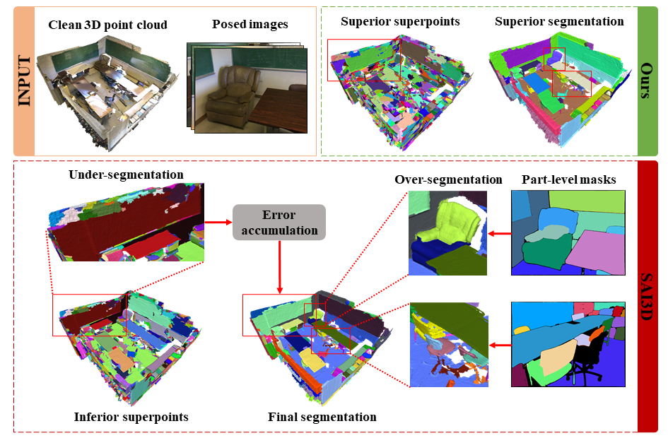


# SA3DIP: Segment Any 3D Instance with Potential 3D Priors

Xi Yang<sup>1</sup>, Xu Gu<sup>1</sup>, Xingyilang Yin<sup>1*</sup>, Xinbo Gao<sup>2</sup>

<sup>1</sup>Xidian University, <sup>2</sup>Chongqing University of Posts and Telecommunications

<sup>*</sup>Corresponding author.

**NeurIPS 2024**

## Introduction

We present SA3DIP, a novel pipeline for segmenting any 3D instances by exploiting potential 3D priors.



Our approach includes incorporating both geometric and color priors on computing 3D superpoints, and introducing constraint provided by 3D prior at the merging stage. We also propose a point-level enhanced version of ScanNetV2, **ScanNetV2-INS**, specifically for 3D class-agnostic instance segmentation by rectifying incomplete annotations and incorporating more instances.

## ScanNetV2-INS Dataset

We provide the gt class-agnostic masks in txt files. You can download them in this codebase (ScanNetV2-INS_gt.zip).

### Format

We generate a txt file (e.g., sceneid.txt) for each scene in the original ScanNetV2 validation set. The txt file contains N separate lines corresponding to N points in the scene, where the number of each line is calculated as: 
```bash
Number = instance id (refers to n-th object in the scene) + 1000 * semantic label id (refers to scannetv2-labels.combined.tsv)
```
The newly labelled instances were assigned a semantic label id of 41 since we focus on class-agnostic segmentation.

### Usage for evaluating class-agnostic results

We follow the evaluatation process in [SAI3D](https://github.com/yd-yin/SAI3D). In total 19 classes (initial 20 classes minus wall minus ceiling plus newly labeled objects with id 41) of gt masks are used as our gt class-agnostic masks, and the AP score is reported over all of the foreground masks. Download `ScanNetV2-INS_gt.zip` and extract it into your `GT_DIR`.

   1. Prepare environment for ScanNet benchmark
      ```bash
      conda create -n eval python=2.7
      conda activate eval
      cd evaluation
      pip install -r requirements.txt
      ```
   2. Before evaluation, you need to align the format of your segmentation result with the evaluation file. The expected format of predicted masks should be:
      ```
      ScanNet_result
       ├── scene0000_00_pred_mask
       │   ├── scene0000_00_1.txt
       │   ├── scene0000_00_2.txt
       │   ├── ...
       │   ├── scene0000_00_n.txt
       ├── ...
       ├── scenexxxx_xx_pred_mask
       │   ├── scenexxxx_xx_1.txt
       │   ├── scenexxxx_xx_2.txt
       │   ├── ...
       │   ├── scenexxxx_xx_n.txt
       ├── scene0000_00.txt
       ├── ...
       ├── scenexxxx_xx.txt
      ```
      The n txt files in each folder `scenexxxx_xx_pred_mask` correspond to n instances of your predicted masks.

      Each txt file `scenexxxx_xx_n.txt` contains n separated lines corresponding to the n points in the scene point cloud. The value 0 indicates background and value 1 indicates the predicted point of the current instance.

      The `scenexxxx_xx.txt` at the bottom provides the path of each instance of current scene to the evaluation script. It contains many `scenexxxx_xx_pred_mask/scenexxxx_xx_n.txt 1 1.000000`. The `1` and `1.000000` indicate label_id and confidence, but we set them all to value 1 since we store every instance in separate txt files and we don't consider confidence here.

   3. Start evaluation
      ```bash
      python evaluation/evaluate_class_agnostic_instance.py \
      --pred_path PREDICTION_DIR \
      --gt_path GT_DIR
      ```
      The numerical results will be saved under the directory of your predictions by default.

### Example for evaluation
We provide an example for converting SAM3D-like masks (stored in pth) to the format desired and evaluate the AP values. 
   1. Align format of masks
      ```bash
      cd example
      python exportlabel.py
      ```
      `exportlabel.py` requires torch to read the pth file. You can use any python environment with any version of torch since it only uses the load function. This would create a folder `SAM3D_txt` storing the masks with desired format.
   3. Start evaluation
      ```bash
      conda activate eval
      python evaluation/evaluate_class_agnostic_instance.py --pred_path SAM3D_txt --gt_path [path_to_your_gt_folder]
      ```
      The numerical results will be saved under SAM3D_txt by default.
	
## SA3DIP

### Usage

#### Installation

Prepare environment

```bash
conda create -n sa3dip python=3.8
conda activate sa3dip
pip install torch==1.13.1+cu117 torchvision==0.14.1+cu117 torchaudio==0.13.1 --extra-index-url https://download.pytorch.org/whl/cu117
pip install open3d natsort matplotlib tqdm opencv-python scipy plyfile
```

Install Semantic-SAM

```bash
git clone https://github.com/UX-Decoder/Semantic-SAM.git Semantic-SAM --recursive
#if you encounter any problem about cuda version, try using cuda11.8 with the following command
#conda install nvidia/label/cuda-11.8.0::cuda  
python -m pip install 'git+https://github.com/MaureenZOU/detectron2-xyz.git'
pip install git+https://github.com/cocodataset/panopticapi.git
cd Semantic_SAM
python -m pip install -r requirements.txt
cd semantic_sam/body/encoder/ops
sh ./make.sh
cd - && mkdir checkpoints && cd checkpoints
wget https://github.com/UX-Decoder/Semantic-SAM/releases/download/checkpoint/swinl_only_sam_many2many.pth
```

#### Data Preparation

##### ScanNet
Download [ScanNetV2 / ScanNet200](https://github.com/ScanNet/ScanNet) and organize the dataset as follows:

```
data
 ├── ScanNet
 │   ├── posed_images
 │   |   ├── scene0000_00
 │   |   │   ├──intrinsic_color.txt   
 │   |   │   ├──intrinsic_depth.txt   
 │   |   │   ├──0000.jpg     //rgb image
 │   |   │   ├──0000.png     //depth image
 │   |   │   ├──0000.txt     //extrinsic
 │   |   │   └── ...
 │   |   └── ...
 │   ├── scans
 │   |   ├── scene0000_00
 │   |   └── ...
 │   ├── Tasks
 │   |   ├── Benchmark
 │   |   │   ├──scannetv2_val.txt  
 │   |   │   ├──scannetv2_train.txt  
 │   |   │   └── ...
```


#### Get class-agnostic masks

1. **Obtain 2D SAM results**
   
   Change [the config here](https://github.com/UX-Decoder/Semantic-SAM/blob/e3b9/configs/semantic_sam_only_sa-1b_swinL.yaml#L42) to false, and set the required parameter in this [script](scripts/sam_scannet.sh) then run:
   ```bash
   bash ./scripts/sam_scannet.sh
   ```

   The results will be stored at `data/ScanNet/2D_masks`, where the 2D segmentation results and visualization of 2D masks will be named as `maskraw_<frame_number>.png` and `maskcolor_<frame_number>.png` respectively.

2. **Obtain 3D finer superpoints**
   We doesn't use the off-the-shelf superpoints provided in `scans/<scene_id>/<scene_id>_vh_clean_2.0.010000.segs.json`. However, we still follow the similar paradigm to obtain the superpoints and export the results in the same format.

   To generate the superpoint on mesh yourself, use the modified segmentator in the folder `superpoints_generation`. The usage is as follows:
   
   ./segmentator input.ply [kThresh=0.01] [segMinVerts=20] [colorWeight=0.04]

   The first argument is a path to an input mesh in PLY format. The second (optional) argument is the segmentation cluster threshold parameter (larger values lead to larger segments). The third (optional) argument is the minimum number of vertices per-segment, enforced by merging small clusters into larger segments.
   The forth argument is to control the contribution of the texture. Increasing colorWeight means decreasing normal weight at the same time (their summation always equals to 1 automatically).


3. **3D instance segmentation by region growing**

   Set the required parameter in this [script](scripts/seg_scannet.sh), then run SA3DIP by using the following command:
   
   ```bash
   bash scripts/seg_scannet.sh
   ```

   The resulting class-agnostic masks will be exported into the format for [ScanNet instance segmentation benchmark](https://github.com/ScanNet/ScanNet/blob/master/BenchmarkScripts/3d_evaluation/evaluate_semantic_instance.py).

4. **Obtain and organize 3D instance bounding boxes**
   
   We provide the organized bounding boxes generated by [V-DETR](https://github.com/V-DETR/V-DETR) in `detection.zip`. You can follow the same format (by checking the key/value term in pth file using torch) and leverage other bounding boxes obtained by any detection methods.
   
4. **Refine the results in step 3** 
	
   Modify the according `pred` and `pcd` path in `batchmerge.py` and run:
   
   ```bash
   python ./det_post/batchmerge.py
   ```


#### Evaluate class-agnostic results
   Now you can implement class-agnostic evaluation directly on the results we got, which focuses only on the accuracy of the instance masks without considering any semantic label

   1. Prepare environment for ScanNet benchmark
      ```bash
      conda create -n eval python=2.7
      conda activate eval
      cd evaluation
      pip install -r requirements.txt
      ```
   2. Start evaluation
      ```bash
      python evauation/evaluate_class_agnostic_instance.py \
      --pred_path=PREDICTION_DIR \
      --gt_path=GT_DIR
      ```

   The numerical results will be saved under the directory of your predictions by default.

#### Visualize class-agnostic results
   Functions in [helpers/visualize.py](helpers/visualize.py) are used to transform the results in txt form into mesh(.ply) for visualization.


## Acknoledgments

We would like to thank the authors of <a href="https://github.com/yd-yin/SAI3D">SAI3D</a> and <a href="https://github.com/V-DETR/V-DETR">V-DETR</a> for their works which were used for our model.
</div>

## BibTeX :pray:

```
@inproceedings{yang2024sa3dip,
  title={{Sa3dip}: Segment any 3d instance with potential 3d priors},
  author={Yang, Xi and Gu, Xu and Yin, Xingyilang and Gao, Xinbo},
  booktitle={Advances in Neural Information Processing Systems},
  year={2024}
}

```



